# IEC Telecom - Figma-Ready Sitemap

**Purpose:** Import this structure into Figma (FigJam sitemap template, Autoflow plugin, or manual frames) for IA workshops and design kickoff.  
**Version:** 1.0  
**Base URL:** `https://iec-telecom.com/en/`

---

## How to Use in Figma

1. Create a **FigJam** board or **Figma** page named `Sitemap - IEC Telecom v1`.
2. Use **frame naming convention:** `L{level} / {Section} / {Page}` (e.g. `L1 / Industries / Maritime`).
3. Color-code frames:
   - **L0** Home - brand primary fill
   - **L1** Primary nav - navy stroke
   - **L2** Section landing - blue stroke
   - **L3** Detail pages - gray stroke
   - **Utility** - dashed stroke (login, legal, search)
4. Connect parent → child with Autoflow or connector lines.
5. Tag frames with labels: `NEW`, `RESTRUCTURE`, `KEEP`, `MERGE`, `REDIRECT`.

---

## Legend

| Tag | Meaning |
|-----|---------|
| KEEP | Existing page, minimal changes |
| RESTRUCTURE | URL or nav placement changes |
| NEW | New page or template needed |
| MERGE | Combine multiple current pages |
| REDIRECT | Old URL → new URL (301) |

---

## L0 - Home

```
[HOME]  /
Tag: RESTRUCTURE
Notes: New hero, 3 news cards, vertical markets strip, CTA blocks - remove full contact form
```

---

## L1 - Solutions

```
[SOLUTIONS]  /solutions/
Tag: NEW (parent landing)
│
├── Satellite Communications          /solutions/satellite-communications/     KEEP
├── Starlink Portfolio                /solutions/starlink/                     RESTRUCTURE (elevate from menu)
├── Hybrid & Multi-Orbit Connectivity /solutions/hybrid-connectivity/          NEW or MERGE from content
└── Managed Services                  /solutions/managed-services/             NEW
```

**Current URL mapping:**

| Proposed | Current |
|----------|---------|
| Starlink Portfolio | `/en/our-offer/starlink-portfolio/` (verify) |
| All Satellite Products | `/en/our-offer/all-satellite-products-solutions/` |

---

## L1 - Industries

```
[INDUSTRIES]  /industries/
Tag: NEW (parent landing)
│
├── MARITIME  /industries/maritime/
│   ├── Shipping              /industries/maritime/shipping/           KEEP
│   ├── Fishing               /industries/maritime/fishing/            KEEP
│   ├── Energy – Offshore     /industries/maritime/energy-offshore/    RESTRUCTURE
│   └── Superyachts           /industries/maritime/superyachts/        RESTRUCTURE (was Yachting)
│
└── LAND  /industries/land/
    ├── Government            /industries/land/government/             KEEP
    ├── Humanitarian          /industries/land/humanitarian/           KEEP (fix casing)
    ├── Energy – Onshore      /industries/land/energy-onshore/         RESTRUCTURE (was Energy - Inland)
    ├── Enterprise            /industries/land/enterprise/             KEEP
    └── Media                 /industries/land/media/                  KEEP
```

**Naming standardization (apply everywhere):**

- `Superyachts` (not Yachting)
- `Humanitarian` (not humanitarian)
- `Energy – Onshore` (not Energy - Inland)
- En-dash in compound names: `Energy – Offshore`

---

## L1 - Products & Services

```
[PRODUCTS & SERVICES]  /products/
Tag: RESTRUCTURE
│
├── [FEATURED]
│   ├── OptiView – Network Management       /products/optiview/              KEEP
│   ├── OptiSim – Provisioning & Billing    /products/optisim/               KEEP
│   └── OptiShield – Cybersecurity          /products/optishield/            KEEP
│
├── [COMMUNICATIONS]
│   ├── OneMail Pro                           /products/onemail-pro/           KEEP
│   ├── OneAssist – Remote Maintenance        /products/oneassist/             KEEP
│   └── OneMonitor – Remote Surveillance      /products/onemonitor/            KEEP
│
├── [OPERATIONS]
│   ├── OneHealth – Telemedicine              /products/onehealth/             KEEP
│   ├── Traksat – PTT, IoT & Tracking         /products/traksat/               KEEP
│   └── IEC Voucher Management System         /products/voucher-management/    KEEP
│
├── [SUPPORT SERVICES]
│   ├── Global 24/7 Technical Support         /products/24-7-support/            KEEP
│   └── Logistics, Training & Maintenance     /products/logistics-training/      KEEP
│
└── View All Value Added Services             /products/                       MERGE listing
```

**Nav treatment:** Show 3 featured + “View all” in mega-menu; full list on `/products/`.

---

## L1 - About

```
[ABOUT]  /about/
Tag: RESTRUCTURE
│
├── Introduction        /about/introduction/        KEEP
├── History             /about/history/             KEEP
├── Management          /about/management/          KEEP
└── Our Partners        /about/partners/
    ├── Satellite Operators           /about/partners/satellite-operators/           KEEP
    ├── Equipment Manufacturers       /about/partners/equipment-manufacturers/      KEEP
    └── Application Partners          /about/partners/application-partners/          KEEP
```

---

## L1 - Regional Offices

```
[REGIONAL OFFICES]  /offices/
Tag: RESTRUCTURE
│
├── [EUROPE]
│   ├── Europe (HQ overview)    /offices/europe/           KEEP
│   ├── Norway                  /offices/norway/             KEEP
│   └── Sweden                  /offices/sweden/             KEEP
│
├── [MIDDLE EAST & AFRICA]
│   ├── UAE                     /offices/uae/                KEEP
│   └── Tunisia                 /offices/tunisia/            KEEP
│
├── [ASIA-PACIFIC]
│   ├── Indonesia               /offices/indonesia/          KEEP
│   ├── Malaysia                /offices/malaysia/           KEEP
│   ├── Singapore               /offices/singapore/          KEEP
│   └── Kazakhstan              /offices/kazakhstan/         KEEP
│
└── Turkey                      /offices/turkey/             KEEP
```

**Figma note:** Add optional `Offices Map` interactive component on landing page - tag NEW.

---

## L1 - News

```
[NEWS]  /news/
Tag: KEEP (improve listing UX)
│
├── All                     /news/                         KEEP
├── Publications            /news/publications/              KEEP
├── Insights                /news/insights/                  KEEP
├── Events                  /news/events/                    KEEP
├── Press Releases          /news/press-releases/            KEEP
└── Latest Updates          /news/latest-updates/            KEEP
```

**Listing page:** Filter tabs instead of separate nav entries in mega-menu.

---

## L1 - Support

```
[SUPPORT]  /support/
Tag: RESTRUCTURE
│
├── Support Headquarters    /support/headquarters/           KEEP
├── Support UAE             /support/uae/                    KEEP
└── Download Center         /support/download-center/        KEEP
```

---

## L1 - Contact

```
[CONTACT]  /contact/
Tag: RESTRUCTURE
│
├── Contact Us (form)           /contact/                      RESTRUCTURE (move form off homepage)
├── Worldwide Contacts          /contact/worldwide/              KEEP
├── Become Our Partner          /contact/become-partner/         KEEP
└── Join Our Team               /contact/careers/                KEEP
```

---

## Utility Pages (Dashed Frames)

```
[SEARCH]                    /search/                           NEW
[CLIENT PORTALS]
├── OptiView Login          (external URL)                     KEEP
└── OptiSim Login           (external URL)                     KEEP

[LANGUAGE]
├── EN  /en/
├── FR  /fr/
├── ID  /id/
├── NO  /no/
├── RU  /ru/
├── TR  /tr/
└── ZH  /zh/

[LEGAL]
├── Legal Notices           /legal-notices/                    KEEP
├── Privacy Policy          /privacy-policy/                   KEEP
└── Cookie Settings         (modal / page)                     NEW
```

---

## Footer-Only Links (Mirror L1 - No Separate Top Nav)

These appear in footer columns but may not need L1 frames:

- Careers → `/contact/careers/`
- Starlink → `/solutions/starlink/`
- Maritime → `/industries/maritime/`
- Social: Facebook, YouTube, LinkedIn

---

## Navigation → Sitemap Matrix

Use this table in Figma as a sticky note on the board.

| Top Nav (Row 1) | Mega-menu children | Landing URL |
|-----------------|-------------------|-------------|
| Solutions | 4 items + featured Starlink | `/solutions/` |
| Industries | Maritime (4), Land (5) | `/industries/` |
| Products & Services | 3 featured + View all | `/products/` |
| About | 3 + Partners submenu | `/about/` |
| News | - (direct link) | `/news/` |
| Contact | - (direct link) | `/contact/` |

| Top Nav (Row 2) | Links to |
|-----------------|----------|
| Starlink | `/solutions/starlink/` |
| Maritime | `/industries/maritime/` |
| Land | `/industries/land/` |
| Support | `/support/` |
| Offices | `/offices/` |
| Partners | `/contact/become-partner/` |

| Utility | Links to |
|---------|----------|
| Search | `/search/` |
| Client Portals ▾ | OptiView, OptiSim |
| EN ▾ | Language versions |

---

## Redirect Map (301) - Sticky Note for Dev

| Old path (verify live) | New path |
|------------------------|----------|
| `/en/vertical-markets/maritime/shipping/` | `/en/industries/maritime/shipping/` |
| `/en/our-offer/starlink-portfolio/` | `/en/solutions/starlink/` |
| Homepage `#contact` anchor | `/en/contact/` |

*Run full crawl before launch to complete redirect table.*

---

## Figma Frame List (Copy-Paste Checklist)

Total primary frames: **~45** (adjust after URL crawl)

### Batch 1 - L1 Landings (8 frames)

- [ ] Home
- [ ] Solutions
- [ ] Industries
- [ ] Products & Services
- [ ] About
- [ ] Regional Offices
- [ ] News
- [ ] Support
- [ ] Contact

### Batch 2 - Industries (9 frames)

- [ ] Maritime (landing)
- [ ] Shipping, Fishing, Energy Offshore, Superyachts
- [ ] Land (landing)
- [ ] Government, Humanitarian, Energy Onshore, Enterprise, Media

### Batch 3 - Products (12 frames)

- [ ] Products index
- [ ] OptiView, OptiSim, OptiShield
- [ ] OneMail, OneAssist, OneMonitor, OneHealth, Traksat
- [ ] Voucher, 24/7 Support, Logistics

### Batch 4 - About + Offices + Utility (15+ frames)

- [ ] Introduction, History, Management
- [ ] Partners + 3 partner types
- [ ] 10 office pages (or 4 region landings + detail)
- [ ] Search, Legal, Privacy

---

## Mermaid Diagram (For FigJam / Documentation Embed)

```mermaid
flowchart TD
    HOME[Home]

    HOME --> SOL[Solutions]
    HOME --> IND[Industries]
    HOME --> PROD[Products & Services]
    HOME --> ABT[About]
    HOME --> OFF[Regional Offices]
    HOME --> NEWS[News]
    HOME --> SUP[Support]
    HOME --> CON[Contact]

    SOL --> SOL1[Satellite Comms]
    SOL --> SOL2[Starlink]
    SOL --> SOL3[Hybrid]
    SOL --> SOL4[Managed]

    IND --> MAR[Maritime]
    IND --> LND[Land]
    MAR --> MAR1[Shipping]
    MAR --> MAR2[Fishing]
    MAR --> MAR3[Offshore Energy]
    MAR --> MAR4[Superyachts]
    LND --> LND1[Government]
    LND --> LND2[Humanitarian]
    LND --> LND3[Onshore Energy]
    LND --> LND4[Enterprise]
    LND --> LND5[Media]

    PROD --> P1[OptiView]
    PROD --> P2[OptiSim]
    PROD --> P3[OptiShield]
    PROD --> PALL[View All]

    ABT --> A1[Introduction]
    ABT --> A2[History]
    ABT --> A3[Management]
    ABT --> A4[Partners]

    CON --> C1[Contact Form]
    CON --> C2[Worldwide]
    CON --> C3[Become Partner]
    CON --> C4[Careers]
```



---

## Page Template Types (Figma Component Mapping)

| Template ID | Used for | Key blocks |
|-------------|----------|------------|
| `TPL-01` | Home | Hero, trust strip, news×3, markets, why IEC, office CTA |
| `TPL-02` | L1 landing | Hero, intro, child link grid, CTA |
| `TPL-03` | Industry / solution detail | Hero, benefits, use cases, related links, contact CTA |
| `TPL-04` | Product | Hero, features, specs, related products, demo CTA |
| `TPL-05` | About / office | Content + sidebar nav |
| `TPL-06` | News listing | Filters, card grid, pagination |
| `TPL-07` | News article | Article body, share, related |
| `TPL-08` | Contact | Form, office finder, map |
| `TPL-09` | Legal | Simple text layout |

---

*Pairs with: [UX Audit](./iec-telecom-ux-audit-report.md) · [PDF Outline](./iec-telecom-client-pdf-outline.md) · [Phase 1 Spec](./iec-telecom-phase-1-implementation-spec.md)*
